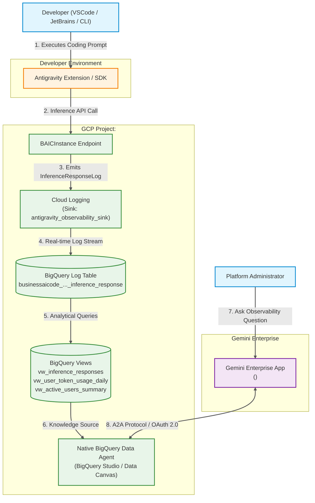
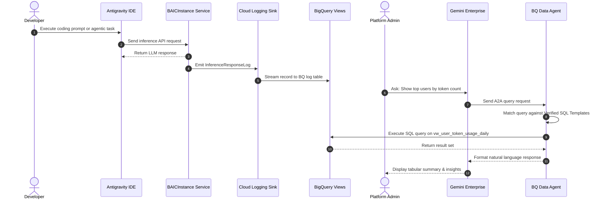
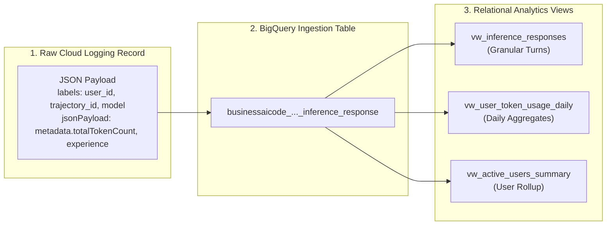
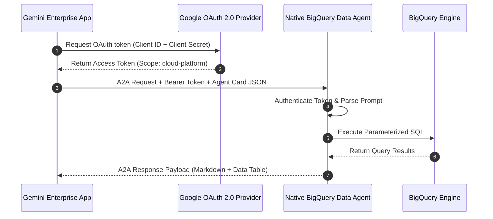

# Google Antigravity Enterprise Observability: Architecture & Flows

> **Target Audience**: GCP Platform Administrators, Security Engineers, and AI Architects.  
> **Core Concept**: A didactic visual guide explaining how developer telemetry flows from Google Antigravity IDE sessions into BigQuery, gets transformed into SQL analytics views, and powers conversational AI observability in Gemini Enterprise via a Native BigQuery Data Agent (A2A).

---

## 1. System Architecture (C4 Container View)

This high-level architecture diagram illustrates the system boundaries, data flow, and components across GCP project **`<YOUR_PROJECT_ID>`**.

### 1.1 Architecture Diagram



---

### 1.2 ASCII System Map Fallback

```
+---------------------------------------------------------------------------------------------------+
| DEVELOPER ENVIRONMENT                                                                             |
|  [ Developer ] ---> ( Antigravity IDE Extension / CLI )                                           |
+---------------------------------------------------------------------------------------------------+
                                   | (1. Inference Request)
                                   v
+---------------------------------------------------------------------------------------------------+
| GCP PROJECT: <YOUR_PROJECT_ID>                                                                    |
|                                                                                                   |
|  +-----------------------+      +---------------------------+      +---------------------------+  |
|  | BAICInstance Endpoint | ---> | Cloud Logging             | ---> | BigQuery Dataset          |  |
|  |                       |      | (antigravity_obs_sink)    |      | (antigravity_observability|  |
|  +-----------------------+      +---------------------------+      +---------------------------+  |
|                                                                                  |                |
|                                                                                  v                |
|                                                                    +---------------------------+  |
|                                                                    | SQL Analytics Views       |  |
|                                                                    | - vw_inference_responses  |  |
|                                                                    | - vw_user_token_usage_daily|  |
|                                                                    | - vw_active_users_summary |  |
|                                                                    +---------------------------+  |
|                                                                                  |                |
|                                                                                  v                |
|                                                                    +---------------------------+  |
|                                                                    | Native BQ Data Agent      |  |
|                                                                    | (BigQuery Studio Canvas)  |  |
|                                                                    +---------------------------+  |
+---------------------------------------------------------------------------------------------------+
                                                                                   ^
                                                                                   | (A2A + OAuth2)
+----------------------------------------------------------------------------------+----------------+
| GEMINI ENTERPRISE                                                                                 |
|  [ Platform Admin ] ---> ( Gemini Enterprise App: <YOUR_ENGINE_ID> )                              |
+---------------------------------------------------------------------------------------------------+
```

---

### 1.3 System Component Legend & Roles

| Component | GCP Identifier / Path | Responsibility & Role |
| :--- | :--- | :--- |
| **BAICInstance** | `resource.type="businessaicode.googleapis.com/BAICInstance"` | Antigravity AI inference service handling developer prompts. |
| **Cloud Logging Sink** | `antigravity_observability_sink` | Filtered log exporter routing `InferenceResponseLog` records to BigQuery. |
| **BigQuery Table** | `<YOUR_PROJECT_ID>.antigravity_observability.businessaicode_...` | Ingestion table receiving real-time log records from Cloud Logging. |
| **BigQuery Views** | `<YOUR_PROJECT_ID>.antigravity_observability.vw_*` | Relational analytics views parsing JSON metadata into structured columns. |
| **Native BQ Data Agent**| `Antigravity Observability Agent` | BigQuery Studio AI agent equipped with instructions and SQL templates. |
| **Gemini Enterprise App**| `projects/<YOUR_PROJECT_NUMBER>/.../engines/<YOUR_ENGINE_ID>` | Primary conversational chat UI for enterprise administrators. |

---

## 2. End-to-End Telemetry & Observability Sequence

This sequence diagram illustrates the lifecycle of a developer query—from IDE execution to administrative chat query in Gemini Enterprise.

### 2.1 Sequence Diagram



---

### 2.2 Detailed Step-by-Step Flow Narration

1. **Step 1 (Prompt Execution)**: A developer triggers a coding prompt or multi-turn agentic trajectory in VSCode/JetBrains.
2. **Step 2 (Inference Call)**: The Antigravity extension sends an API call to the `BAICInstance` backend endpoint.
3. **Step 3 (Response Generation)**: The model processes the request and returns code completions or suggestions.
4. **Step 4 (Log Emission)**: The `BAICInstance` service emits an `InferenceResponseLog` event containing metadata (`user_id`, `trajectory_id`, `model`, `totalTokenCount`).
5. **Step 5 (Log Export)**: The Cloud Logging sink (`antigravity_observability_sink`) intercepts the log and streams it into the `<YOUR_PROJECT_ID>.antigravity_observability` BigQuery dataset.
6. **Step 6 (Query Initiation)**: A Platform Admin asks a question in Gemini Enterprise App `<YOUR_ENGINE_ID>` (e.g., *"Which developer used the most tokens today?"*).
7. **Step 7 (A2A Dispatch)**: Gemini Enterprise dispatches the request to the Native BigQuery Data Agent over the A2A (Agent-to-Agent) protocol using OAuth 2.0 credentials.
8. **Step 8 (SQL Generation & Execution)**: The Data Agent matches the prompt against system instructions and verified SQL templates, then executes a read-only query on `vw_user_token_usage_daily`.
9. **Step 9 (Data Retrieval & Formatting)**: BigQuery returns the result set, and the Data Agent formats it into clear prose and markdown tables.
10. **Step 10 (Presentation)**: Gemini Enterprise renders the response to the administrator.

---

## 3. Data Transformation & Schema Evolution Walkthrough

This section details how raw JSON log payloads are converted into structured SQL views for analytics.

### 3.1 Data Pipeline Diagram



---

### 3.2 Schema Transformation Layout

```
RAW LOG PAYLOAD (JSON)                             PARSED BIGQUERY VIEW COLUMNS
+------------------------------------------+       +------------------------------------------+
| labels: {                                |       | timestamp       : TIMESTAMP              |
|   "user_id": "user@example.com",         | ----> | user_id         : STRING                 |
|   "trajectory_id": "traj_9a8f7b...",     | ----> | trajectory_id   : STRING (Session ID)    |
|   "request_id": "req_123456...",         | ----> | request_id      : STRING (Turn ID)       |
|   "client_name": "VSCode Extension",     | ----> | client_name     : STRING                 |
|   "client_version": "1.12.0",            | ----> | client_version  : STRING                 |
|   "model": "gemini-2.5-pro"              | ----> | model           : STRING                 |
| }                                        |       | experience      : STRING                 |
| jsonPayload: {                           | ----> | total_token_count: INT64                 |
|   "experience": "CHAT",                  |       +------------------------------------------+
|   "metadata": {                          |
|     "totalTokenCount": 4820              |
|   }                                      |
| }                                        |
+------------------------------------------+
```

---

## 4. A2A Protocol & OAuth 2.0 Integration Flow

The BigQuery Data Agent communicates with Gemini Enterprise via the **Agent-to-Agent (A2A)** protocol. Below is the handshake and query execution sequence.

### 4.1 A2A Handshake Sequence



---

### 4.2 OAuth 2.0 Endpoint Configuration

| Parameter | Value / URI |
| :--- | :--- |
| **Application Type** | Web application |
| **Client Name** | `Gemini Enterprise - Antigravity BQ Data Agent Connector` |
| **Authorized Redirect URIs** | `https://vertexaisearch.cloud.google.com/oauth-redirect`<br/>`https://vertexaisearch.cloud.google.com/static/oauth/oauth.html` |
| **Authorization Endpoint** | `https://accounts.google.com/o/oauth2/v2/auth?access_type=offline&prompt=consent` |
| **Token Endpoint** | `https://oauth2.googleapis.com/token` |
| **Required OAuth Scope** | `https://www.googleapis.com/auth/cloud-platform` |

---

## 5. Verification & Operational Runbook

To verify that all components in your project are healthy, run the commands below:

### 5.1 Verify Cloud Logging Sink & Dataset
```bash
# Check Cloud Logging Sink status
gcloud logging sinks describe antigravity_observability_sink --project=${PROJECT_ID}

# Check BigQuery Dataset details
bq show --project_id=${PROJECT_ID} ${PROJECT_ID}:antigravity_observability
```

### 5.2 Test BigQuery Views Execution
```bash
# Run test query on daily token usage view
bq query --use_legacy_sql=false --project_id=${PROJECT_ID} \
"SELECT * FROM \`${PROJECT_ID}.antigravity_observability.vw_user_token_usage_daily\` LIMIT 5;"
```

### 5.3 List Registered Gemini Enterprise Apps
```bash
# List Gemini Enterprise engines in project
agents-cli publish gemini-enterprise --list --project=${PROJECT_ID}
```
