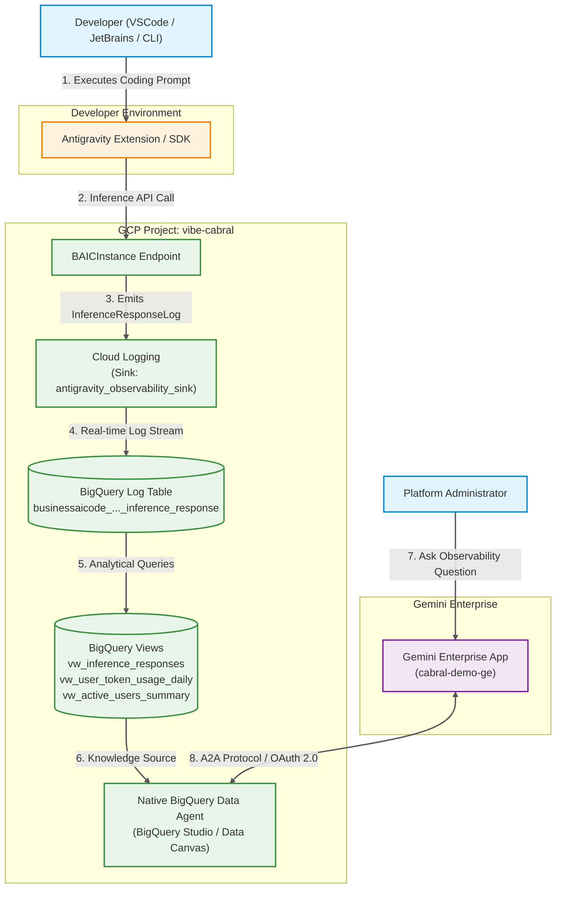

# Antigravity Enterprise Observability: Complete End-to-End Setup Guide

> **Project**: `vibe-cabral` (Project Number: `280799742875`)  
> **Target Gemini Enterprise App**: `projects/280799742875/locations/global/collections/default_collection/engines/cabral-demo-ge_1772569093320`  
> **Dataset**: `vibe-cabral.antigravity_observability` (Location `US`)

---

## 1. Overview & Architecture Summary

This guide provides an overly detailed, production-grade specification for setting up **Enterprise Observability for Google Antigravity** in project `vibe-cabral` and integrating it with **Gemini Enterprise App** (`cabral-demo-ge`).

### 1.1 Architecture & Component Map (Visual-Docs C4 View)



---

## 2. Automation Matrix: What is Automated vs. What is Manual

| Component / Task | Status | Script / Tool | Responsibility |
| :--- | :--- | :--- | :--- |
| **BigQuery Dataset Creation** | **AUTOMATED** | `scripts/01_setup_bq_and_sink.sh` | Creates `vibe-cabral.antigravity_observability` dataset in location `US`. |
| **Cloud Logging Sink Setup** | **AUTOMATED** | `scripts/01_setup_bq_and_sink.sh` | Creates `antigravity_observability_sink` routing `BAICInstance` logs. |
| **IAM Permission Grant** | **AUTOMATED** | `gcloud projects add-iam-policy-binding` | Grants `roles/bigquery.dataEditor` to Logging Sink Service Account. |
| **Log-Based Metric** | **AUTOMATED** | `scripts/01_setup_bq_and_sink.sh` | Creates `businessaicode-users` metric in Cloud Logging. |
| **BigQuery Analytics Views** | **AUTOMATED** | `scripts/02_create_bq_views.sh` | Builds `vw_inference_responses`, `vw_user_token_usage_daily`, `vw_active_users_summary`. |
| **Historical Log Backfill** | **AUTOMATED** | `scripts/backfill_logs.py` | Exports past Cloud Logging records and loads them into BigQuery. |
| **Native BQ Data Agent Creation** | **MANUAL** | BigQuery Studio UI | Interactive Data Canvas agent creation & A2A card export in GCP Console. |
| **GCP OAuth 2.0 Credentials** | **MANUAL** | GCP Console (APIs & Services) | Creation of Web Client ID + Secret with Authorized Redirect URIs. |
| **Gemini Enterprise A2A Import** | **SEMI-AUTOMATED** | `scripts/03_publish_a2a_agent.sh` | Manual UI import or CLI invocation with exported A2A Agent Card URL. |

---

## 3. IAM Permissions & Security Blueprint

To ensure data security and operational log streaming, enforce the exact IAM roles and service account bindings below:

### 3.1 Cloud Logging Sink Service Account
- **Service Account**: `service-280799742875@gcp-sa-logging.iam.gserviceaccount.com`
- **Required Role**: `roles/bigquery.dataEditor` on project `vibe-cabral` (or dataset `antigravity_observability`).
- **GCloud Command**:
  ```bash
  gcloud projects add-iam-policy-binding vibe-cabral \
    --member="serviceAccount:service-280799742875@gcp-sa-logging.iam.gserviceaccount.com" \
    --role="roles/bigquery.dataEditor" \
    --condition=None
  ```

### 3.2 Gemini Enterprise A2A Connector & Admin Roles
- **OAuth Scope**: `https://www.googleapis.com/auth/cloud-platform`
- **Admin Roles required for Setup**:
  - `roles/bigquery.admin`
  - `roles/logging.admin`
  - `roles/resourcemanager.projectIamAdmin`
  - `roles/discoveryengine.admin` (Gemini Enterprise Admin)

---

## 4. Cloud Logging Filters & Log Schema Deep Dive

### 4.1 Cloud Logging Explorer Filters

Use these exact filter expressions in **GCP Console -> Cloud Logging -> Logs Explorer**:

#### Base Filter (All Antigravity Activity)
```logging
resource.type="businessaicode.googleapis.com/BAICInstance"
```

#### Inference Response Logs Only (Tokens, Models, Sessions)
```logging
resource.type="businessaicode.googleapis.com/BAICInstance"
logName="projects/vibe-cabral/logs/businessaicode.googleapis.com%2Finference_response"
```

#### Client Telemetry Logs Only (IDE Events, Status, Resolution)
```logging
resource.type="businessaicode.googleapis.com/BAICInstance"
logName="projects/vibe-cabral/logs/businessaicode.googleapis.com%2Fclient_telemetry"
```

#### Filter by Specific Developer
```logging
resource.type="businessaicode.googleapis.com/BAICInstance"
labels.user_id="user:admin@carloscabral.altostrat.com"
```

#### Filter by Trajectory / Session ID
```logging
resource.type="businessaicode.googleapis.com/BAICInstance"
labels.trajectory_id="97383408-97d5-4478-8a12-b36f99aae3af"
```

---

### 4.2 BigQuery Table Schema & JSON Extraction Rules

When querying BigQuery table `businessaicode_googleapis_com_inference_response`:
- `labels` column is native `JSON` type.
- `jsonPayload` column is native `JSON` type.

> [!IMPORTANT]
> Because `labels` and `jsonPayload` are native `JSON` types in BigQuery, use **dot notation**:
> - `JSON_VALUE(labels.user_id)`
> - `JSON_VALUE(labels.trajectory_id)`
> - `JSON_VALUE(labels.model)`
> - `JSON_VALUE(jsonPayload.experience)`
> - `SAFE_CAST(JSON_VALUE(jsonPayload.metadata.totalTokenCount) AS INT64)`

---

## 5. BigQuery Data Agent Blueprint (BigQuery Studio)

> **Knowledge Source Selection Note**: In BigQuery Studio, select **`vibe-cabral.antigravity_observability.businessaicode_googleapis_com_inference_response`** (Base Table) and/or views `vw_user_token_usage_daily`, `vw_inference_responses`, `vw_active_users_summary`.  
> If the UI picker limits selection to standard tables, select base table `businessaicode_googleapis_com_inference_response`. The Agent instructions and golden queries below instruct the model on how to query both base tables and SQL views seamlessly.

### 5.1 System Instructions Blueprint

Copy and paste the exact markdown text below into the **Agent Instructions** field in BigQuery Studio:

```markdown
# Antigravity Observability Assistant Instructions

You are an expert Enterprise AI Observability Analyst for Google Antigravity in GCP project `vibe-cabral`. You answer questions regarding developer productivity, token usage, active sessions, AI models used, and IDE client adoption using dataset `vibe-cabral.antigravity_observability`.

## Key Knowledge Sources & Tables/Views

1. Base Table: `businessaicode_googleapis_com_inference_response`
   - Contains raw JSON logs. Use dot notation for JSON extraction:
     `JSON_VALUE(labels.user_id)`, `JSON_VALUE(labels.trajectory_id)`, `JSON_VALUE(labels.model)`, `JSON_VALUE(jsonPayload.experience)`, `SAFE_CAST(JSON_VALUE(jsonPayload.metadata.totalTokenCount) AS INT64)`.
2. `vw_inference_responses`: Granular record of every Antigravity inference request.
   - Key Columns: `timestamp`, `user_id`, `trajectory_id`, `request_id`, `client_name`, `client_version`, `model`, `experience`, `total_token_count`.
3. `vw_user_token_usage_daily`: Pre-aggregated daily token usage and request counts per user, model, and client.
   - Key Columns: `usage_date`, `user_id`, `client_name`, `client_version`, `model`, `request_count`, `trajectory_count`, `total_tokens`, `avg_tokens_per_request`.
4. `vw_active_users_summary`: Overview of user activity, first/last seen timestamps, session counts, and total token usage.
   - Key Columns: `user_id`, `total_sessions`, `total_requests`, `total_token_consumption`, `first_seen`, `last_seen`.

## Business Terms Glossary

- "Developer" / "User" -> `user_id`
- "Session" / "Trajectory" -> `trajectory_id` / `COUNT(DISTINCT trajectory_id)`
- "API Call" / "Request" -> `COUNT(1)`
- "Tokens" / "Token Consumption" -> `SUM(total_tokens)` or `SUM(total_token_count)`
- "Surface" / "Experience" -> `experience` (e.g., CHAT, INLINE_COMPLETION)

## Default Filtering & Performance Rules

- Unless specified otherwise, limit queries to the last 7 days (`usage_date >= DATE_SUB(CURRENT_DATE(), INTERVAL 7 DAY)` or `timestamp >= TIMESTAMP_SUB(CURRENT_TIMESTAMP(), INTERVAL 7 DAY)`).
- Never issue `DROP`, `INSERT`, `UPDATE`, or `DELETE` statements. Return only read-only `SELECT` queries.
- Format token numbers clearly (e.g., using commas or displaying in thousands/millions `K`/`M`).
```

---

### 5.2 Golden Verified SQL Queries

Add these 5 empirically tested queries into the **Verified Queries / Examples** section:

#### Query 1: Daily Token Usage Trend
```sql
SELECT
  usage_date,
  model,
  SUM(total_tokens) AS total_tokens,
  SUM(request_count) AS total_requests
FROM
  `vibe-cabral.antigravity_observability.vw_user_token_usage_daily`
WHERE
  usage_date >= DATE_SUB(CURRENT_DATE(), INTERVAL 14 DAY)
GROUP BY
  usage_date, model
ORDER BY
  usage_date DESC, total_tokens DESC;
```

#### Query 2: Top 10 Developers by Token Usage
```sql
SELECT
  user_id,
  SUM(total_tokens) AS total_tokens_consumed,
  SUM(trajectory_count) AS total_sessions,
  SUM(request_count) AS total_api_requests
FROM
  `vibe-cabral.antigravity_observability.vw_user_token_usage_daily`
WHERE
  usage_date >= DATE_TRUNC(CURRENT_DATE(), MONTH)
GROUP BY
  user_id
ORDER BY
  total_tokens_consumed DESC
LIMIT 10;
```

#### Query 3: Active User Count & Session Volume
```sql
SELECT
  COUNT(DISTINCT user_id) AS active_developers,
  SUM(trajectory_count) AS total_sessions,
  SUM(request_count) AS total_requests,
  SUM(total_tokens) AS total_tokens
FROM
  `vibe-cabral.antigravity_observability.vw_user_token_usage_daily`
WHERE
  usage_date = CURRENT_DATE();
```

#### Query 4: Average Tokens per Session Trajectory
```sql
SELECT
  JSON_VALUE(labels.model) AS model,
  COUNT(DISTINCT JSON_VALUE(labels.trajectory_id)) AS total_sessions,
  COUNT(1) AS total_requests,
  SUM(SAFE_CAST(JSON_VALUE(jsonPayload.metadata.totalTokenCount) AS INT64)) AS total_tokens,
  ROUND(SUM(SAFE_CAST(JSON_VALUE(jsonPayload.metadata.totalTokenCount) AS INT64)) / SAFE_CAST(COUNT(DISTINCT JSON_VALUE(labels.trajectory_id)) AS FLOAT64), 2) AS avg_tokens_per_session
FROM
  `vibe-cabral.antigravity_observability.businessaicode_googleapis_com_inference_response`
WHERE
  timestamp >= TIMESTAMP_SUB(CURRENT_TIMESTAMP(), INTERVAL 30 DAY)
GROUP BY
  model
ORDER BY
  total_tokens DESC;
```

#### Query 5: Client Extension Version Adoption
```sql
SELECT
  JSON_VALUE(labels.client_name) AS client_name,
  JSON_VALUE(labels.client_version) AS client_version,
  COUNT(DISTINCT JSON_VALUE(labels.user_id)) AS user_count,
  COUNT(1) AS request_count
FROM
  `vibe-cabral.antigravity_observability.businessaicode_googleapis_com_inference_response`
WHERE
  timestamp >= TIMESTAMP_SUB(CURRENT_TIMESTAMP(), INTERVAL 7 DAY)
GROUP BY
  client_name, client_version
ORDER BY
  request_count DESC;
```

---

## 6. Step-by-Step GCP Console Manual Execution Guide

### Step 6.1: Native BigQuery Data Agent Setup (BigQuery Studio)
1. Navigate to **Google Cloud Console** -> Select project `vibe-cabral`.
2. Go to **BigQuery** -> **BigQuery Studio** -> **Data Agents**.
3. Click **+ New Agent**.
4. Set Name: `Antigravity Observability Agent`.
5. Add Knowledge Sources: Select base table `vibe-cabral.antigravity_observability.businessaicode_googleapis_com_inference_response` (and views `vw_inference_responses`, `vw_user_token_usage_daily`, `vw_active_users_summary` if displayed).
6. Add Instructions: Paste Section 5.1 blueprint.
7. Add Verified Queries: Paste Section 5.2 SQL templates.
8. Click **Publish** -> **Export as A2A Agent Card**. Copy/download the JSON file.

### Step 6.2: Create GCP OAuth 2.0 Credentials
1. Go to **GCP Console** -> **APIs & Services** -> **Credentials** (`vibe-cabral`).
2. Click **+ CREATE CREDENTIALS** -> **OAuth client ID**.
3. Application Type: **Web application**.
4. Name: `Gemini Enterprise - Antigravity BQ Data Agent Connector`.
5. Add Authorized Redirect URIs:
   - `https://vertexaisearch.cloud.google.com/oauth-redirect`
   - `https://vertexaisearch.cloud.google.com/static/oauth/oauth.html`
6. Click **CREATE** and save **Client ID** and **Client Secret**.

### Step 6.3: Import Agent into Gemini Enterprise App (`cabral-demo-ge`)
1. Open **Gemini Enterprise Admin Console** -> Select engine `cabral-demo-ge`.
2. Go to **Agents** -> **Add Agent** -> **Import via A2A Protocol**.
3. Upload/Paste the A2A Agent Card JSON.
4. Set Auth:
   - **Auth Type**: `OAuth 2.0 (Authorization Code)`
   - **Client ID**: `<YOUR_CLIENT_ID>`
   - **Client Secret**: `<YOUR_CLIENT_SECRET>`
   - **Authorization Endpoint**: `https://accounts.google.com/o/oauth2/v2/auth`
   - **Token Endpoint**: `https://oauth2.googleapis.com/token`
   - **Scopes**: `https://www.googleapis.com/auth/cloud-platform`
5. Click **Save & Enable**.

Alternatively, run via script:
```bash
./scripts/03_publish_a2a_agent.sh https://storage.googleapis.com/vibe-cabral-agent-cards/agent-card.json
```

---

## 7. Troubleshooting & Common Pitfalls Runbook

| Symptom / Issue | Cause | Exact Resolution |
| :--- | :--- | :--- |
| **BigQuery log table is empty (`0 rows`)** | Missing IAM role on Cloud Logging Sink Writer SA. | Run `gcloud projects add-iam-policy-binding vibe-cabral --member="serviceAccount:service-280799742875@gcp-sa-logging.iam.gserviceaccount.com" --role="roles/bigquery.dataEditor" --condition=None`. |
| **Existing logs in Cloud Logging not showing in BigQuery** | Sink only streams *new* logs from time of authorization. | Run `python3 scripts/backfill_logs.py` to backfill existing logs. |
| **Cannot select Views in Data Agent source picker** | BigQuery Studio UI source selector filters by standard tables (`TABLE`). | Select the base table `vibe-cabral.antigravity_observability.businessaicode_googleapis_com_inference_response` as the knowledge source. The System Instructions and Verified Queries will handle both table and view SQL generation seamlessly. |
| **`Invalid JSON Path` error in BigQuery queries** | Using legacy string syntax `JSON_VALUE(labels, '$.user_id')` on native `JSON` column. | Use native dot notation: `JSON_VALUE(labels.user_id)` or `JSON_VALUE(jsonPayload.experience)`. |
| **A2A Authentication failed in Gemini Enterprise** | Missing redirect URIs in GCP OAuth Client. | Ensure both `https://vertexaisearch.cloud.google.com/oauth-redirect` and `https://vertexaisearch.cloud.google.com/static/oauth/oauth.html` are added to Authorized Redirect URIs. |
